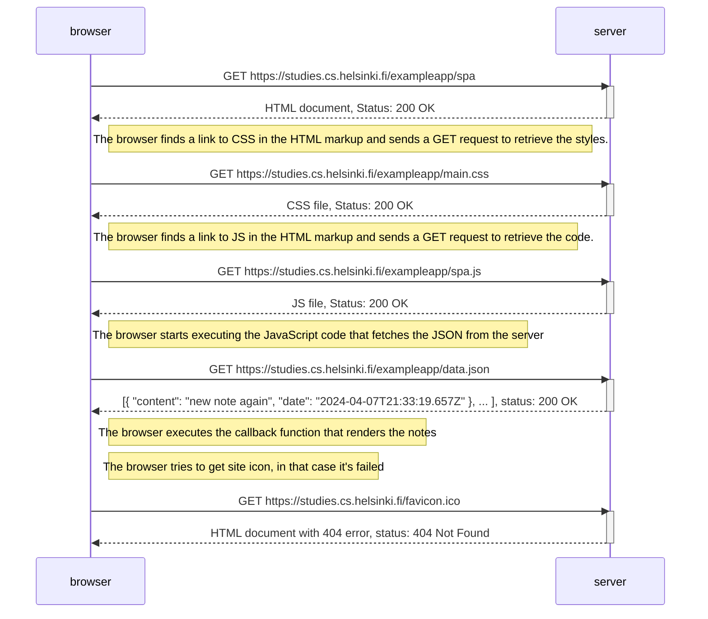

```mermaid
sequenceDiagram
    participant browser
    participant server

    browser->>server: GET https://studies.cs.helsinki.fi/exampleapp/spa
    activate server
    server-->>browser: HTML document, Status: 200 OK
    deactivate server

    Note right of browser: The browser finds a link to CSS in the HTML markup and sends a GET request to retrieve the styles.

    browser->>server: GET https://studies.cs.helsinki.fi/exampleapp/main.css
    activate server
    server-->>browser: CSS file, Status: 200 OK
    deactivate server

    Note right of browser: The browser finds a link to JS in the HTML markup and sends a GET request to retrieve the code.

    browser->>server: GET https://studies.cs.helsinki.fi/exampleapp/spa.js
    activate server
    server-->>browser: JS file, Status: 200 OK
    deactivate server

    Note right of browser: The browser starts executing the JavaScript code that fetches the JSON from the server

    browser->>server: GET https://studies.cs.helsinki.fi/exampleapp/data.json
    activate server
    server-->>browser: [{ "content": "new note again", "date": "2024-04-07T21:33:19.657Z" }, ... ], status: 200 OK
    deactivate server

    Note right of browser: The browser executes the callback function that renders the notes

    Note right of browser: The browser tries to get site icon, in that case it's failed

    browser->>server: GET https://studies.cs.helsinki.fi/favicon.ico
    activate server
    server-->>browser: HTML document with 404 error, status: 404 Not Found
    deactivate server
```
