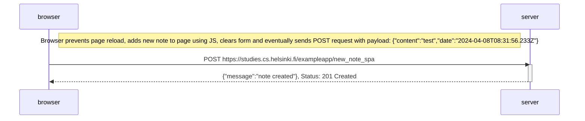

```mermaid
sequenceDiagram
    participant browser
    participant server

    Note right of browser: Browser prevents page reload, adds new note to page using JS, clears form and eventually sends POST request with payload: {"content":"test","date":"2024-04-08T08:31:56.233Z"}

    browser->>server: POST https://studies.cs.helsinki.fi/exampleapp/new_note_spa
    activate server
    server-->>browser: {"message":"note created"}, Status: 201 Created
    deactivate server
```